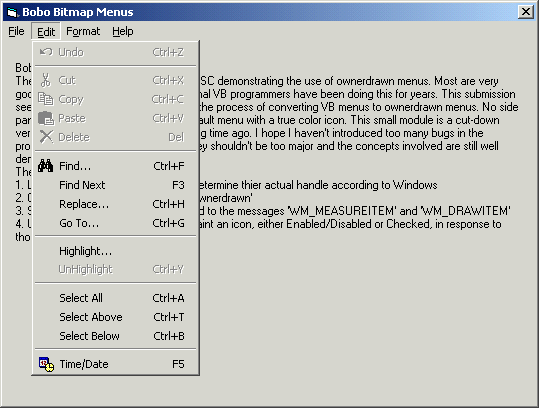



## Bobo Bitmap Menus Simplified

### Description

There are quite a few submissions on PSC demonstrating the use of ownerdrawn menus. Most are very good, I voted for them ! However, for some folks they were a bit complex and hard to understand. I hope this helps clarify the process for less experienced coders. Most professional VB programmers have been doing this for years. This submission seeks to simplify, as much as possible, the process of converting VB menus to ownerdrawn menus. No side panels, crazy fonts/colors - just the default menu with a true color icon. This small module is a cut-down version of a template I wrote a long, long time ago. I hope I haven't introduced too many bugs in the process of simplifying it, but if I have they shouldn't be too major and the concepts involved are still well demonstrated.

The tasks :

1. Locate all VBmenus on a form and determine thier actual handle according to Windows

2. Change the type of each menu to 'Ownerdrawn'

3. Subclass the form so we can respond to the messages 'WM_MEASUREITEM' and 'WM_DRAWITEM'

4. Use the API to print a caption and paint an icon, either Enabled/Disabled or Checked, in response to those messages.
 
### More Info
 

             |
---                |---
**Submitted On**   |2003-04-15 08:40:04
**By**             |[MrBobo](https://github.com/Planet-Source-Code/PSCIndex/blob/master/ByAuthor/mrbobo.md)
**Level**          |Intermediate
**User Rating**    |5.0 (99 globes from 20 users)
**Compatibility**  |VB 6\.0
**Category**       |[VB function enhancement](https://github.com/Planet-Source-Code/PSCIndex/blob/master/ByCategory/vb-function-enhancement__1-25.md)
**World**          |[Visual Basic](https://github.com/Planet-Source-Code/PSCIndex/blob/master/ByWorld/visual-basic.md)
**Archive File**   |[Bobo\_Bitma1574024152003\.zip](https://github.com/Planet-Source-Code/mrbobo-bobo-bitmap-menus-simplified__1-44758/archive/master.zip)

